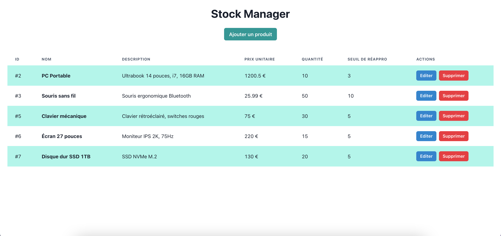
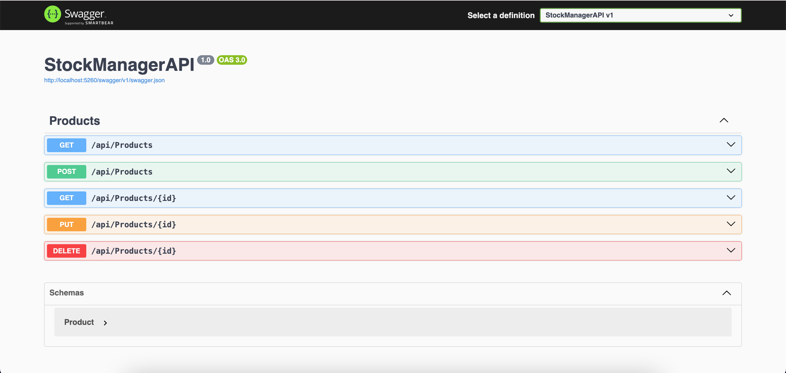

# Stock Manager

Full-stack application to manage a product inventory, using **ASP.NET Core** for the backend and **React** for the frontend.



---

## Sommaire

- [Prerequisites](#prerequisites)
- [Installation](#installation)
- [Features](#features)
- [Project Structure](#project-structure)
- [Database](#database)
- [How to Use the Application](#how-to-use-the-application)

---

## Prerequisites

- .NET 9 SDK : https://dotnet.microsoft.com/en-us/download
- Node.js (>= 18) : https://nodejs.org/en/download/
  and npm

---

## Installation

**1. Clone the project**

```bash
git clone https://github.com/meline-p/StockManager.git
cd StockManager/V2Web
```

**2. Set up the backend (ASP.NET Core)**

- Go to the StockManagerAPI folder:

```bash
cd StockManagerAPI
```

- Restore NuGet dependencies:

```bash
dotnet restore
```

- Build the project:

```bash
dotnet build
```

- Run the API server:

```bash
dotnet run
```

- The API will be accessible at `http://localhost:5260/api/products`

- Swagger UI is available at `http://localhost:5260/swagger`



**3. Set up the frontend (React + Vite)**

- Go to the clientapp folder:

```bash
cd ../clientapp
```

- Install npm dependencies:

```bash
npm install
```

- Start the React server:

```bash
npm run dev
```

- The application will be accessible at `http://localhost:5173`

**4. Configure Frontend-Backend Communication**

In `clientapp/src/api.js`, make sure all URLs point to the correct API endpoint, for example:

```bash
const BASE_URL = "http://localhost:5260/api/products";
```

This ensures that `getProducts`, `addProduct`, `updateProduct`, and `deleteProduct` work correctly.

---

## Features

- Product List: Displays all products in the inventory

- Add Product: Form to create a new product

- Update Product: Form to modify an existing product

- Delete Product: Remove a product directly from the list

---

## Project Structure

```bash
V2Web/
    StockManagerAPI/         # ASP.NET Core Backend
        Controllers/         # REST Controllers
        Models/              # C# Models
        Data/                # DbContext
        Program.cs           # Application configuration
    clientapp/               # React + Vite Frontend
        src/
            components/      # ProductList, AddProduct, UpdateProduct
            api.js           # API fetch functions
            App.jsx          # Main component
```

---

### Database

The database is managed using Entity Framework Core / SQLite.

To view the SQLite database:

```bash
cd StockManagerAPI
dotnet tool install --global dotnet-ef
dotnet ef migrations add InitialCreate
dotnet ef database update
```

---

### How to Use the Application

1. Open http://localhost:5173 in a browser.

2. The product list will appear automatically.

3. To add a product:

   - Click "Add" to open the modal window

   - Fill out the “Add Product” form

   - Click Add

4. To edit a product:

   - Click "Edit" next to the product, and a model window will open

   - Change the name, quantity, etc...

   - Click "Update" or "Cancel"

5. To delete a product:

   - Click "Delete" next to the product

   - The product will be removed from the list
